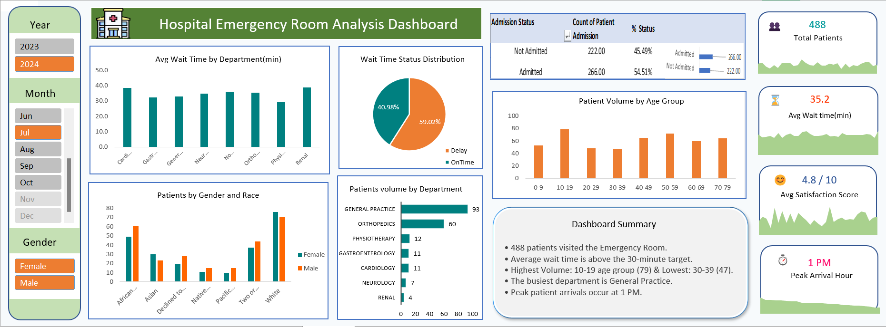

# 🏥 Hospital Emergency Room Performance Analysis – Excel

An interactive **Excel data analysis project** focused on analyzing Hospital Emergency Room performance using **Power Query, Pivot Tables, Pivot Charts, dynamic KPI calculations, slicers, and interactive visualizations**.

## 🎯 Project Objective

Transform raw emergency room data into a structured, visual, and interactive dashboard that helps understand:

* Patient visit volume and trends
* Average patient waiting time
* Admission patterns
* Patient demographics
* Department performance
* Emergency room workload and efficiency

## 💡 Key Features

- 📊 Interactive ER Performance Report
- 🔄 Dynamic Summary that updates automatically based on selected filters
- 🕐 Peak Hour KPI to identify high-demand periods
- 🎛️ Interactive Slicers and Filters
- 📈 Pivot Chart-based visual analysis
- ⏱️ Patient Waiting-Time Analysis
- 🏥 Admission and Department Referral Analysis
- 👥 Patient Demographic Analysis

## 📷 Dashboard Preview

   
  
## 🛠️ Tools & Technologies

- **Microsoft Excel** 
   - **Power Query** – Data cleaning and transformation
   - **Power Pivot** – Data connection and data modeling
   - **Pivot Tables** – Data aggregation and KPI calculations
   - **Excel Formulas** – Calculations and analytical logic

